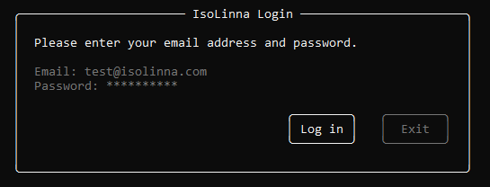

# IsoLinna Control Panel
<div style="display: flex; gap: 10px;">
  
  
</div>

## Installation
### Raspberry Pi & Raspberry Pi OS
#### Update the System
```sh
sudo apt-get update &&  sudo apt-get dist-upgrade && echo +++ upgrade successful +++
```
#### Install BlueZ
```sh
sudo apt-get install bluez bluez-hcidump
```
#### (optional) Create and activate a virtual environment
```sh
python -m venv .venv
source .venv/bin/activate
```
#### Update pip and setuptools
```sh
python -m pip install --upgrade pip
python -m pip install --upgrade setuptools
```
#### Install Python packages
```sh
python -m pip install pyrebase4
python -m pip install ruuvitag-sensor
python -m pip install urwid
```
Please note that you have to install pyrebase4 which is a forked version of Pyrebase. Application won't work on regular Pyrebase.
#### Create isolinna.json
Create a isolinna.json-file with following information:
```sh
{
  "apiKey": "Your project's API key",
  "authDomain": "Domain name used for your Firebase Authentication",
  "databaseURL": "URL of your Firebase Realtime Database",
  "storageBucket": "URL of your Firebase Storage bucket",
}
```
#### Run the application
```sh
python isolinna.py
```
